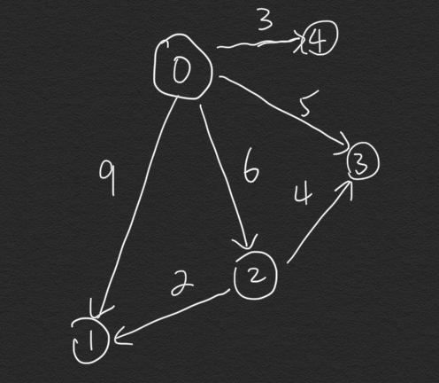

# Dijkstra
Here I use min-priority queue in java to implement Dijkstra algorithm.  
`Dijkstra.java` is the main class to run the algorithm.  
`Vertex.java` is the imported class to create graph.

  

* Someone would write an additional `ExtractMin()` to help find out the smallest `dist[]` in queue. In fact, the second parameter of `PriorityQueue` accepts a comparator. We can override the comparator of vertex interface to follow the ordering of `dist`. When we use `PriorityQueue(num of vertices, new Vertex())`, we just need to find the head element then we can get the one with smallest distance.  
* Why can't Dijkstra accept the edges with negative weights? The reason is that Dijkstra separates vertices to queue and set, the distance of vertices in set won't be changed anymore. However, if there is a edge with negative weight, it might affect the result of distance in set again, and this conflicts with the concept of Dijkstra works.